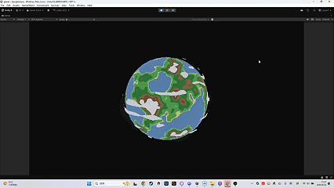

# Unity 像素风程序化星球交互系统

基于 Unity 6 和 URP 开发的可交互三维像素星球，实现程序化地形、动态云层、风格化阴影、鼠标旋转与滚轮缩放。

## 演示
<p align="center">
  
</p>
## 功能

- 鼠标拖动控制星球 360° 旋转
- 鼠标滚轮推进和拉远摄像机
- 多层三维噪声生成大陆
- 一维颜色纹理映射地形
- 海洋、海岸、植被、山地和雪地区域
- 风格化亮面、过渡带和紫灰色暗面
- 独立移动的动态云层
- 低分辨率 RenderTexture 像素化渲染
- HDR Fresnel 边缘光与 Bloom

## 技术栈

- Unity 6
- C#
- Universal Render Pipeline
- Shader Graph
- Unity Input System
- Texture3D
- RenderTexture
- Unity.Mathematics

## 操作方式

| 操作 | 功能 |
| --- | --- |
| 按住鼠标左键拖动 | 旋转星球 |
| 鼠标滚轮 | 拉近或拉远摄像机 |

## Unity 版本

```text
Unity 6000.0.69f1
URP 17.0.4
